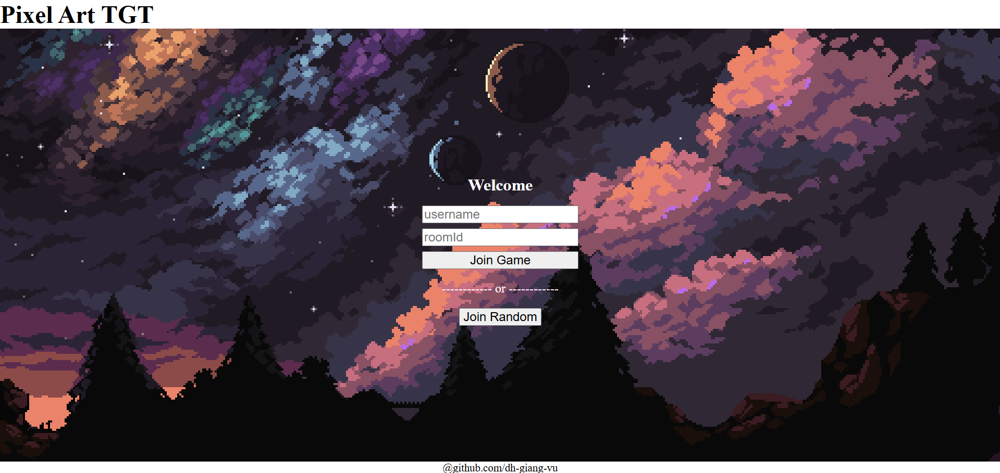
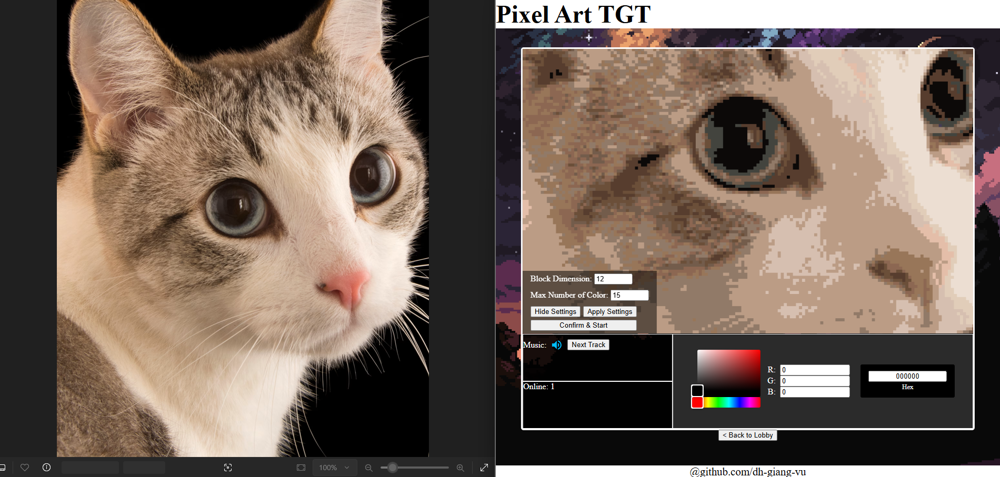
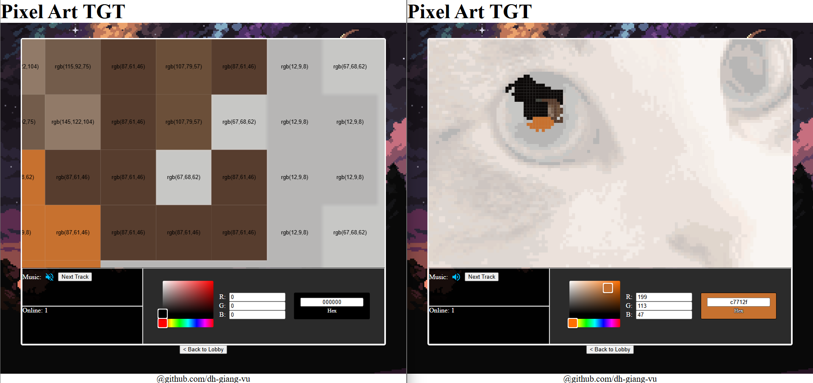

# Pixel Art TGT

**This is a Work In Progress - documentations are limited**

**Check out my other projects here:**

+ [Cloud File Storage System](https://github.com/dh-giang-vu/cloud-file-storage-system)
+ [URL Shortening Web API](https://github.com/dh-giang-vu/NanoUrl)

## Overview

Allow user to create pixel art with others in real time.

### 1. Join room

### 2. Upload any image (to use as a guide)

### 3. Create pixel art

The RGB value of each block is displayed as a guide, however, the user is free to use any colour of their choosing.

